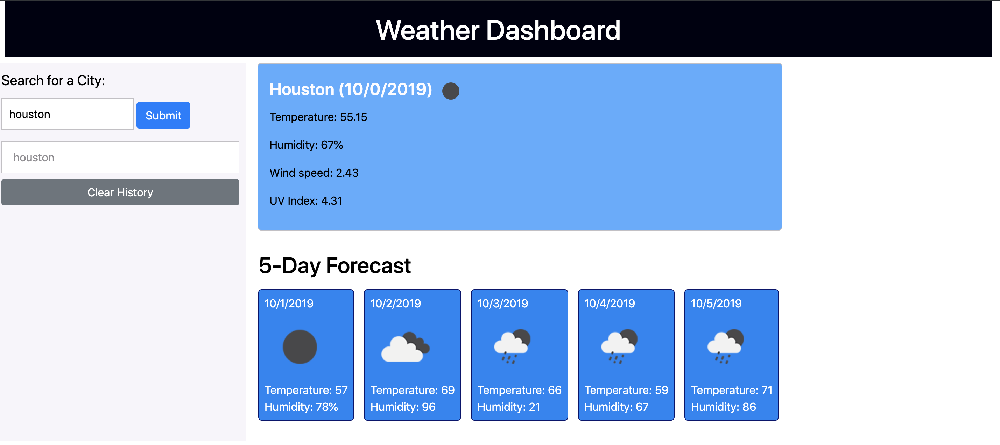

# 06-Weather-Dashboard

## Feeling Sunny
I felt good abou this project. Things started to click more. I understood the AJAX called and navigating JSON. I felt good about the CSS. I felt like my JavaScript and JQuery improved on this project. 

## AJAX Calls
I created three different AJAX calls for this. I did an initial AJAX call for the current day's weather report. I used this response to populate my other AJAX calls.

Using the UV index AJAX requires the longitude and lattitude in the URL. In the first AJAX call, we got the longitude and lattitude for the city. I assigned those to variables and used those variables to construct my url for the UV Index Ajax call.

Using the 5-day forecast required the city ID. We also got that from our initial query. I assigned that to a variable and used that for the url for the 5-day forecast.

### Issues with the AJAX
I used timeout functions for my UV and 5-day functions. I did this because every time I would try to run those scripts, it would come back with an error. During debugging, I determined that the variables I was using for longitude, latitude and cityID weren't populating prior to me calling the AJAX. So I set a half-second timeout for that info. It worked. I think this in fact may be a scoping issue on my part. When I come back to this project to simplify it, that would be something I'd look at

## Reusable Functions
One stride I think I made with this project was the use of reusable functions. That's the freaking point of functions, right? To write reusable code so that when you're doing a task multiple times, you can invoke a function instead of rewriting the code.

In this project, I made personal coding improvement with my todaysWeather function. My initial plan was to write the copy the code in that function and use it in other functions, like my presentTodaysWeatherData function. Instead, I setup muy functions to take inputs, and used those inputs determine how my function ran. wow - that saved me lots of lines of code!!! Was pleased with myself for that. Felt like a major breakthrough in my development as a developer.

My clearDailyForecast function is another example of a simple function that I'm using in multiple places.

## Screenshot
